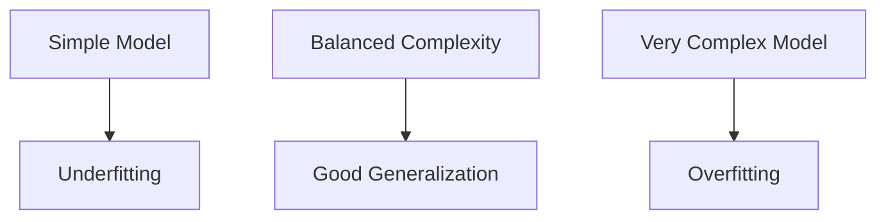

# Supervised Learning

Supervised learning is a core subfield of machine learning where an algorithm learns a mapping from input variables to output variables using labeled training data.

This note structures the concept from its mathematical formulation to practical paradigms, optimization strategies, and theoretical boundaries.

# Formal Mathematical Foundations of Supervised Learning

## 1. Introduction

Supervised learning is the foundational paradigm of modern machine learning.

The objective is to learn a mapping between input variables and output variables using labeled examples.

Formally, supervised learning attempts to estimate an unknown functional relationship:

$$
f : \mathcal{X} \rightarrow \mathcal{Y}
$$

where:

- $\mathcal{X}$ represents the input space
- $\mathcal{Y}$ represents the output space
- $f$ is the predictive function

The learning algorithm observes examples:

$$
(x_i, y_i)
$$

and attempts to infer the hidden relationship governing the data generation process.

This framework underlies:

- Linear Regression
- Logistic Regression
- Support Vector Machines
- Decision Trees
- Neural Networks
- Ensemble Methods

# 2. Statistical View of Learning

Supervised learning assumes that data is generated from an unknown probability distribution:

$$
P(X,Y)
$$

called the **joint probability distribution** over the random variables:

- $X$: input variables
- $Y$: output variables

The learning algorithm never directly observes $P(X,Y)$.

Instead, it observes finite samples drawn from it.

## Intuition

Reality generates examples according to some hidden stochastic process.

Example:

| Features | Label |
|---|---|
| House size, location | House price |
| Email content | Spam / Not Spam |
| Patient measurements | Disease category |

The dataset is therefore only a finite approximation of the underlying distribution.

# 3. Input Space

The input space is defined as:

$$
\mathcal{X} \subseteq \mathbb{R}^d
$$

where:

- $d$ = number of features
- $\mathbb{R}^d$ = $d$-dimensional real-valued vector space

An individual sample is represented as:

$$
x =
\begin{bmatrix}
x_1 \\
x_2 \\
\vdots \\
x_d
\end{bmatrix}
$$

## Example

Suppose we predict house prices using:

- area
- number of rooms
- age

Then:

$$
x =
\begin{bmatrix}
2000 \\
4 \\
10
\end{bmatrix}
$$

represents:

- 2000 sq ft
- 4 rooms
- 10 years old

# 4. Output Space

The output space depends on the problem type.

## Regression

For regression:

$$
\mathcal{Y} \subseteq \mathbb{R}
$$

The output is continuous.

Examples:

- stock prices
- temperatures
- sales forecasting

## Classification

For classification:

### Binary Classification

$$
\mathcal{Y} = \{0,1\}
$$

### Multi-Class Classification

$$
\mathcal{Y} = \{1,2,\dots,C\}
$$

where:

- $C$ = number of classes

# 5. Dataset Formulation

The training dataset consists of:

$$
\mathcal{D}
=
\{
(x_1,y_1),
(x_2,y_2),
\dots,
(x_N,y_N)
\}
$$

where:

- $N$ = number of training samples

# 6. IID Assumption

Training examples are assumed to be:

## Independent and Identically Distributed (IID)

Formally:

$$
(x_i,y_i)
\overset{iid}{\sim}
P(X,Y)
$$

This assumption contains two components:

## Independence

Each sample is statistically independent of others.

Formally:

$$
P(x_i,x_j)=P(x_i)P(x_j)
$$

for independent observations.

## Identically Distributed

All samples originate from the same distribution:

$$
P_{train}(X,Y)=P_{test}(X,Y)
$$

This assumption is often violated in real-world systems due to:

- concept drift
- domain shift
- seasonality
- changing user behavior

# 7. Objective of Learning

The goal is to find a function:

$$
f \in \mathcal{H}
$$

that minimizes prediction error.

# 8. Hypothesis Space

The hypothesis space:

$$
\mathcal{H}
$$

is the set of all candidate functions the model can represent.

## Examples

### Linear Models

$$
f(x)=w^Tx+b
$$

### Polynomial Models

$$
f(x)=w_0+w_1x+w_2x^2+\dots+w_nx^n
$$

### Neural Networks

$$
f(x)=\sigma(W_2\sigma(W_1x+b_1)+b_2)
$$

# 9. Loss Function

The quality of predictions is measured using a loss function:

$$
L(y,f(x))
$$

## Mean Squared Error (Regression)

$$
L(y,\hat{y})=(y-\hat{y})^2
$$

## Mean Absolute Error

$$
L(y,\hat{y})=|y-\hat{y}|
$$

## Binary Cross Entropy

$$
L(y,\hat{y})
=
-y\log(\hat{y})
-(1-y)\log(1-\hat{y})
$$

# 10. Expected Risk

The true learning objective is minimizing expected risk:

$$
R(f)
=
\mathbb{E}_{(X,Y)\sim P(X,Y)}
\left[
L(Y,f(X))
\right]
$$

This represents the expected prediction error over the true data distribution.

## Expanded Form

For continuous variables:

$$
R(f)
=
\int
L(y,f(x))
\, dP(x,y)
$$

For discrete variables:

$$
R(f)
=
\sum_{x,y}
L(y,f(x))P(x,y)
$$

# 11. Empirical Risk Minimization

Since the true distribution is unknown, we approximate risk using the dataset.

The empirical risk is:

$$
\hat{R}(f)
=
\frac{1}{N}
\sum_{i=1}^{N}
L(y_i,f(x_i))
$$

Learning algorithms solve:

$$
f^*
=
\arg\min_{f\in\mathcal{H}}
\hat{R}(f)
$$

This principle is called:

# Empirical Risk Minimization (ERM)

# 12. Learning Pipeline

```mermaid
flowchart LR
    A[Unknown Distribution P(X,Y)] --> B[Sample Dataset]
    B --> C[Training Data]
    C --> D[Model Training]
    D --> E[Learned Function f(x)]
    E --> F[Predictions on Unseen Data]
```

# 13. Optimization Problem

Most supervised learning problems become optimization problems.

## General Optimization Objective

$$
\theta^*
=
\arg\min_{\theta}
\hat{R}(\theta)
$$

where:

- $\theta$ = model parameters

## Linear Regression Example

Model:

$$
\hat{y}=w^Tx+b
$$

Objective:

$$
J(w,b)
=
\frac{1}{N}
\sum_{i=1}^{N}
(y_i-(w^Tx_i+b))^2
$$

# 14. Gradient Descent

Parameters are updated iteratively:

$$
\theta_{t+1}
=
\theta_t
-
\eta
\nabla_\theta J(\theta_t)
$$

where:

- $\eta$ = learning rate
- $\nabla_\theta J$ = gradient

# 15. Generalization

A model must perform well on unseen data.

This ability is called:

# Generalization

## Training Error

$$
\hat{R}_{train}(f)
$$

## Test Error

$$
\hat{R}_{test}(f)
$$

Good models satisfy:

$$
\hat{R}_{train}(f)
\approx
\hat{R}_{test}(f)
$$

# 16. Overfitting

Overfitting occurs when the model memorizes noise.

## Characteristics

- low training error
- high test error

## Visual Intuition



# 17. Bias-Variance Tradeoff

Prediction error decomposes into:

$$
\mathbb{E}
\left[
(Y-\hat{f}(X))^2
\right]
=
Bias^2
+
Variance
+
Noise
$$

## High Bias

- overly simple model
- underfitting

## High Variance

- overly flexible model
- overfitting

# 18. Regularization

Regularization controls model complexity.

## L2 Regularization

$$
J(w)
=
\hat{R}(w)
+
\lambda \|w\|_2^2
$$

## L1 Regularization

$$
J(w)
=
\hat{R}(w)
+
\lambda \|w\|_1
$$

# 19. Bayesian Perspective

Frequentist learning estimates fixed parameters.

Bayesian learning treats parameters as random variables.

## Bayes Rule

$$
P(\theta|D)
=
\frac{P(D|\theta)P(\theta)}{P(D)}
$$

where:

- $P(\theta)$ = prior
- $P(D|\theta)$ = likelihood
- $P(\theta|D)$ = posterior

# 20. Geometric Interpretation

Machine learning can be viewed geometrically.

## Linear Classification

Decision boundary:

$$
w^Tx+b=0
$$

defines a hyperplane separating classes.

## Higher Dimensions

In $d$-dimensional space:

- line → 2D
- plane → 3D
- hyperplane → $d$-dimensions

# 21. Computational Complexity

Training cost depends on:

- dataset size
- feature dimension
- model complexity

## Example Complexity

### Linear Regression (Closed Form)

$$
O(d^3)
$$

due to matrix inversion.

### Gradient Descent

$$
O(Nd)
$$

per iteration.

# 22. Python Example: Linear Regression

```python
import numpy as np
from sklearn.linear_model import LinearRegression

# Training data
X = np.array([
    [1000],
    [1500],
    [2000],
    [2500]
])

y = np.array([
    200000,
    300000,
    400000,
    500000
])

# Create model
model = LinearRegression()

# Train model
model.fit(X, y)

# Predict unseen value
prediction = model.predict([[1800]])

print(prediction)
```

# 23. Python Example: Loss Computation

```python
import numpy as np

# True values
y_true = np.array([3, -0.5, 2, 7])

# Predicted values
y_pred = np.array([2.5, 0.0, 2, 8])

# Mean Squared Error
mse = np.mean((y_true - y_pred) ** 2)

print("MSE:", mse)
```

# 24. Simple Gradient Descent Example

```python
import numpy as np

# Function
def f(x):
    return x**2

# Gradient
def grad(x):
    return 2 * x

x = 10
learning_rate = 0.1

for step in range(20):
    x = x - learning_rate * grad(x)
    print(f"Step {step}: x = {x}")
```

# 25. Complete Learning Framework

```mermaid
flowchart TD
    A[Real World Process] --> B[Unknown Distribution P(X,Y)]
    B --> C[Sample Training Data]
    C --> D[Choose Hypothesis Space]
    D --> E[Define Loss Function]
    E --> F[Optimization]
    F --> G[Learned Model]
    G --> H[Generalization]
```

# 26. Important Hidden Assumptions

## Label Correctness

Assumes labels are accurate.

Often false in practice.

## Stationary Distribution

Assumes future resembles past.

Often violated.

## Sufficient Features

Assumes features contain predictive signal.

Poor features fundamentally limit learning.

# 27. Theoretical Limitation

No model can perfectly infer reality from finite data.

Learning theory fundamentally deals with:

- uncertainty
- approximation
- statistical estimation

# 28. Connection to Deep Learning

Deep learning extends this framework by:

- using extremely large hypothesis spaces
- learning hierarchical representations
- optimizing millions or billions of parameters

Yet the core formulation remains unchanged:

$$
\min_{f\in\mathcal{H}}
\hat{R}(f)
$$

# 29. Final Mathematical Summary

Supervised learning consists of:

## Data

$$
\mathcal{D}
=
\{
(x_i,y_i)
\}_{i=1}^{N}
$$

## Hypothesis Space

$$
f \in \mathcal{H}
$$

## Loss Function

$$
L(y,f(x))
$$

## Objective

$$
f^*
=
\arg\min_{f\in\mathcal{H}}
\frac{1}{N}
\sum_{i=1}^{N}
L(y_i,f(x_i))
$$

# 30. Final Takeaways

Supervised learning is fundamentally:

- statistical inference
- function approximation
- optimization under uncertainty

Its central challenge is not merely fitting data.

The true challenge is:

# learning structure that generalizes beyond observed samples.
