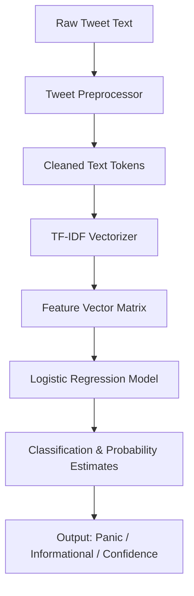

# Banking Crisis Tweets Sentiment Analysis

This project implements a lightweight Machine Learning pipeline designed to classify the sentiment of social media posts (specifically tweets) during bank liquidity crises. The model categorizes inputs into three functional categories: Panic/Alert, Neutral/Informational, and Confidence/Stability. 

The primary utility of this system is to help risk analysts and researchers identify sudden spikes in public panic or systemic fear during financial incidents.

## Pipeline Architecture

The flow of data through the system progresses from raw text acquisition to finalized classification and confidence metrics.



## Text Preprocessing Subsystem

Twitter data presents unique structural attributes (handles, hashtags, URLs) that can introduce noise into traditional classifiers. The preprocessor cleans the input using a sequence of deterministic steps:


## Repository Structure

*   `banking_crisis_pipeline.py`: The core executable file containing synthetic data generation, preprocessing, training, evaluation, and inference classes.
*   `README.md`: System documentation and architectural diagrams.

## Prerequisites and Installation

To execute the code, ensure you have Python 3.8 or higher installed along with the following standard scientific computing and machine learning libraries:

```bash
pip install numpy pandas matplotlib seaborn scikit-learn nltk
```

The script manages NLTK dependency downloads (such as stopwords and WordNet lemmatization corpuses) automatically during its initial execution.

## Usage Instructions

To train the model on the simulated dataset and run the evaluation and inference test suite, execute the main script:

```bash
python banking_crisis_pipeline.py
```

The pipeline will perform the following actions:
1. Generate a balanced synthetic corpus of crisis tweets.
2. Run text-specific cleaning.
3. Split the data into stratified training and validation sets.
4. Extract TF-IDF features (using both unigrams and bigrams).
5. Train a Logistic Regression model adjusting for potential class imbalances.
6. Display validation accuracy, a standard classification report (precision, recall, f1-score), and render a confusion matrix plot.
7. Print real-time classification and confidence probability scores for sample unseen test tweets.

## Implementation Details

### Baseline Performance
The baseline model achieves stable performance metrics on the simulated corpus. Due to the high interpretability of Logistic Regression, feature weights are directly extracted to inspect which words drive each classification (such as "withdraw" and "run" for Panic, or "resilient" and "strong" for Confidence).

### Real-Time Inference Class
An instance of `CrisisSentimentAnalyzer` can be integrated directly into streaming microservices. The class processes raw text inputs dynamically and yields a JSON-like dictionary containing both the predicted category and the confidence distribution across all three labels.
