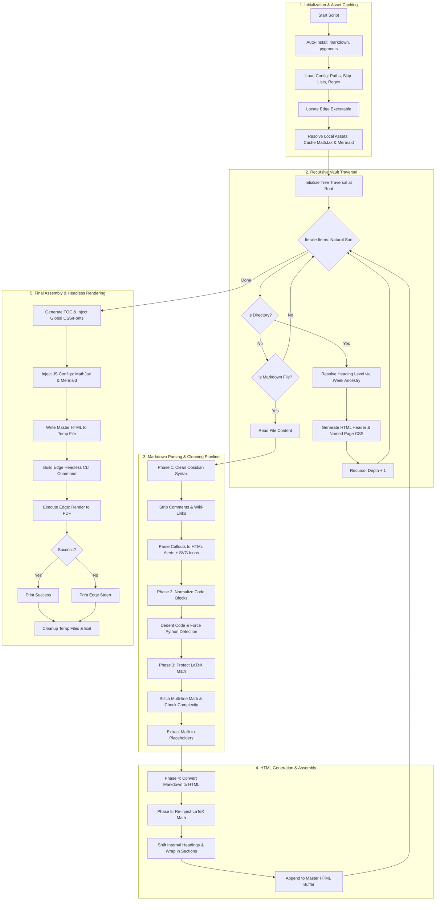

# The Obsidian-to-PDF Compilation Engine: Complete Technical Documentation

## 1. High-Level Architecture and Purpose

This script solves a very specific, annoying problem: Obsidian is a fantastic tool for writing and linking notes, but it is terrible at generating beautiful, unified, print-ready PDF books. If you try to export a whole vault, you get fragmented files, broken LaTeX, messy callouts, and a complete lack of hierarchical structure. 

This Python script acts as a bridge. It crawls your local Obsidian folder, parses the raw Markdown, cleans up Obsidian-specific syntax, intelligently formats mathematical equations, restructures the heading hierarchy to match a book format, and compiles everything into a single, heavily styled HTML document. Finally, it uses Microsoft Edge’s headless rendering engine to print that HTML into a flawless, paginated PDF with a dynamic Table of Contents, custom page borders, and offline-capable math rendering.

### The Execution Flow

Before we dive into the code, here is the exact sequence of operations the script performs.


## 2. Environment Setup and Configuration

The script starts by ensuring it has the tools it needs to run. It does not assume your environment is perfectly set up.

### Auto-Installing Dependencies
The script checks for `markdown` and `pygments`. If they are missing, it automatically triggers `pip install`. This makes the script portable. You can drop it on any Windows machine with Python installed, and it will bootstrap its own dependencies. `markdown` is used to convert the cleaned text to HTML, and `pygments` is used to generate the CSS for syntax-highlighted code blocks.

### Configuration Constants
The configuration section is hardcoded for your specific environment. 
*   **ROOT_FOLDER:** Points directly to your "Data Preprocessing" Obsidian vault.
*   **SKIP_FOLDERS & SKIP_FILES:** Prevents the script from processing asset folders (like `images` or `assets`) or meta-files (like `readme.md`). This keeps the final PDF clean and focused only on actual lecture content.
*   **WEEK_PATTERN:** A regular expression that identifies folder names like "W01", "Week 2", or "WEEK-03". This is the anchor for the entire document hierarchy.

### Microsoft Edge Detection
The script needs a Chromium-based browser to render the final PDF. It checks standard Windows installation paths for Microsoft Edge. If it finds the executable, it stores the path. Edge is chosen over Chrome here because it is natively built into Windows, guaranteeing the script will run on your machine without requiring a separate Chrome installation.

## 3. The Asset Caching System (Tier 3)

When you generate a PDF using a headless browser, the browser needs to load external JavaScript libraries like MathJax (for equations) and Mermaid (for diagrams). If the browser is offline, or if the CDN is slow, the PDF will render with blank spaces where the math should be.

To solve this, the `get_local_or_download` function acts as a local cache. 
1. It checks the system's temporary directory for `mathjax_tex_mml_chtml.js` and `mermaid_10_min.js`.
2. If they are missing, it downloads them from a CDN using `urllib`.
3. It injects these local file paths (`file:///...`) into the final HTML. 

This guarantees that the PDF generation process is 100% offline-capable and immune to network timeouts.

## 4. The Obsidian Parsing Engine

Obsidian uses a flavor of Markdown that standard parsers do not understand. The script runs the raw text through a series of cleaning functions to translate Obsidian syntax into standard HTML.

### Cleaning Core Obsidian Syntax
The `clean_obsidian_markdown` function uses regex to strip out Obsidian-specific artifacts:
*   **Comments:** `%%hidden text%%` is completely removed.
*   **Wiki-Links:** `[[Target|Display Text]]` is converted to standard italics `*Display Text*`. 
*   **Images:** `![[image.png]]` is converted to standard Markdown image syntax ``.

### Handling Obsidian Callouts
Obsidian callouts (like `> [!note] This is a note`) are a massive pain for standard Markdown parsers. The `convert_obsidian_callouts` function uses a state-machine approach to parse them.
1. It reads line by line, looking for the `> [!type]` trigger.
2. Once triggered, it collects all subsequent indented blockquote lines.
3. It passes the collected text back through the Markdown parser to handle any nested formatting.
4. It wraps the result in a custom HTML `<div>` with specific classes (`markdown-alert-note`, `markdown-alert-tip`, etc.).
5. It injects inline SVG icons (pulled from GitHub's Octicons library) directly into the HTML header of the callout, ensuring the icons render perfectly in the PDF without needing external image files.

### Code Block Normalization
Users often mess up indentation in Obsidian code blocks, which breaks syntax highlighting. The `dedent_code_blocks` function finds all fenced code blocks, calculates the minimum indentation of the non-empty lines, and strips that exact amount of whitespace from every line. This ensures the code aligns perfectly to the left margin in the final PDF.

### Smart Language Detection
If a user writes a Python script but forgets to add ````python` to the fence, Pygments won't highlight it. The `force_python_lang_fences` function scans the contents of untagged code blocks. If it sees Python keywords like `import`, `def`, `class`, or `print()`, it automatically tags the block as Python. 

## 5. The Mathematics and LaTeX Engine

This is the most complex part of the script. Standard Markdown parsers destroy LaTeX math because they interpret underscores as italics and asterisks as bold. The script uses a multi-layered approach to protect and format math.

### The Complexity Heuristic Engine
Obsidian users are inconsistent. Sometimes they use `$$` (display math) for a simple variable like `$$x$$`, and sometimes they use `$` (inline math) for a massive equation. The `should_be_display_math` function analyzes the content of the math block to decide how it should be rendered.
*   It checks for structural operators like `\sum`, `\int`, `\frac`, `\begin`.
*   It checks the character length (complex equations are usually over 35 characters).
*   It checks for relation operators (`=`, `<`, `\le`) combined with length.
If the math is complex, it forces it into a centered display block. If it is simple, it downgrades it to inline math, preventing massive, awkward gaps in the text.

### The Line-Cohesion Engine
Markdown parsers break when a single math equation is split across multiple lines. The `normalize_latex_line_breaks` function acts as a state machine to stitch broken math back together.
*   It tracks whether it is currently inside an inline (`$`) or display (`$$`) math block.
*   It counts dollar signs, carefully ignoring escaped dollars (`\$`) and double dollars (`$$`).
*   If a math block is split across lines, it joins them with spaces until the closing dollar sign is found, or until it hits a structural boundary (like a new paragraph or a heading).
This ensures that multi-line equations are merged into a single, unbroken string before the Markdown parser touches them.

### The Placeholder Strategy
The `preserve_math_and_convert` function is the master orchestrator for math. 
1. It finds all display math (`$$...$$`) and inline math (`$...$`).
2. It replaces them with unique, non-mathematical placeholders like `MATHEXPRDISPLAYX0X` and `MATHINLINE1EXP`.
3. It runs the entire document through the standard Markdown-to-HTML conversion. Because the math is hidden inside placeholders, the parser cannot accidentally mangle the LaTeX syntax.
4. After conversion, it swaps the placeholders back with the original, cleaned LaTeX strings.
5. Finally, it injects MathJax configuration into the HTML head so the browser knows how to render the `$` and `$$` tags when the PDF is generated.

## 6. Document Structure and Hierarchy Management

A book needs a strict hierarchy. If every file starts with an H1 (`#`), the PDF Table of Contents will be a flat, useless list. The script dynamically calculates heading levels based on the folder structure.

### Natural Sorting
Standard alphabetical sorting puts "Week 10" before "Week 2". The `natural_sort_key` function splits filenames into text and number chunks, sorting them logically (1, 2, 10) so your weeks and topics appear in the correct chronological order.

### Dynamic Heading Shifting
The `shift_markdown_headings` function looks at the internal headings inside a Markdown file. If a file is placed at a depth where it should be an H2, but the file itself contains H2s and H3s, this function shifts all internal headings down by the required `base_level`. This prevents internal headings from colliding with the global document structure.

### The Tree Parser and Week Anchors
The `compile_notes_to_html` function recursively walks the directory tree. It uses a specific rule for hierarchy:
*   **Week Nodes:** Only folders that match the `WEEK_PATTERN` (e.g., "W01", "Week 1") are allowed to become H1. 
*   **Relative Leveling:** Every other file or folder is leveled relative to its nearest "Week" ancestor. A file inside "Week 1" becomes an H2. A sub-folder inside that becomes an H3.
*   **Outlier Handling:** If a file exists outside any "Week" folder, the script flags it as an outlier and assigns it a fallback hierarchical level, printing a warning to the console.

### Page Breaks and Footers
When the parser encounters an H1 (a Week node), it applies a `force-break` CSS class, ensuring every new week starts on a fresh page. It also dynamically generates CSS `@page` rules for each week, injecting the week's name into the bottom-left footer of every page in that section.

## 7. HTML Generation and CSS Styling

The `build_html_document` function takes the compiled HTML content, the Table of Contents, and the CSS, and wraps it in a master HTML template. The CSS is heavily engineered for print media.

### Print Media and Page Borders
The CSS uses `@page` rules to define the physical dimensions of the PDF. 
*   It sets the size to A4.
*   It applies a thin, elegant gray border (`border: 1px solid #dcdcdc`) around the page area. 
*   It uses `padding: 6mm` to ensure the text never intersects the border.
*   It adds page numbers to the bottom-right corner using `counter(page)`.
*   The `@page :first` rule removes the border and page numbers from the cover page.

### Typography and Fonts
The script loads the 'Afacad' font from Google Fonts for the body text, and 'Geom' (falling back to Century Gothic) for headings. This gives the PDF a modern, clean, academic look. The CSS enforces strict font weights and sizes to ensure consistency across different operating systems.

### Math and Mermaid Styling
The CSS includes specific overrides for MathJax (`mjx-container`) and Mermaid diagrams. 
*   It forces the math color to match the theme's navy blue (`#004C87`).
*   It fixes a common rendering bug where MathJax containers clip vertical descenders by setting `overflow: visible !important`.
*   It centers Mermaid diagrams and forces them to use the same typography as the rest of the document.

### Callout and Table Aesthetics
The CSS defines the visual style for the custom callout HTML generated earlier, applying colored left-borders and subtle background fills based on the callout type (blue for notes, green for tips, yellow for warnings). Tables are styled with a solid navy blue header row and alternating row colors for readability.

## 8. The PDF Rendering Pipeline

The final phase is the actual generation of the PDF. This is handled by the `main` function, which orchestrates the entire pipeline and executes the headless browser.

### Orchestrating the Build
1.  **Asset Resolution:** It calls the caching system to ensure MathJax and Mermaid are available locally.
2.  **Compilation:** It calls `compile_notes_to_html` to crawl the vault and build the content blocks.
3.  **Templating:** It calls `build_html_document` to wrap everything in the final HTML/CSS template.
4.  **File Writing:** It writes the massive HTML string to a temporary file in the system's temp directory.

### Microsoft Edge Headless Execution
The script constructs a command-line array to launch Microsoft Edge in headless mode. The flags used here are highly specific and critical for a successful render:

*   `--headless=old`: Uses the legacy headless mode. The new headless mode in Chromium sometimes struggles with complex print layouts and PDF generation. The old mode is much more stable for this specific task.
*   `--disable-gpu`: Prevents the browser from trying to use hardware acceleration, which can cause crashes in headless environments or virtual machines.
*   `--no-pdf-header-footer`: Tells Edge not to inject its default "Printed by Chrome" URL headers or date footers, leaving the custom CSS footers clean.
*   `--generate-pdf-document-outline`: This is the magic flag. It reads the HTML heading tags (`<h1>`, `<h2>`, etc.) and automatically generates a clickable, hierarchical bookmark outline in the final PDF sidebar.
*   `--virtual-time-budget=25000`: This is arguably the most important flag. MathJax and Mermaid are heavy JavaScript libraries. When the browser loads the HTML, it needs time to download the scripts, parse the LaTeX, and render the SVGs. If Edge prints the PDF immediately, the math will just show up as raw text. This flag tells the browser to wait up to 25 seconds of "virtual time" for all JavaScript to finish executing before it triggers the print dialog.
*   `--run-all-compositor-stages-before-draw`: Ensures that all visual layers, fonts, and layouts are fully calculated and painted before the PDF snapshot is taken, preventing blank pages or unstyled content.
*   `--print-to-pdf`: Specifies the exact output path for the final PDF.

### Error Handling and Cleanup
The script wraps the subprocess call in a `try-except` block. If Edge fails to render the PDF (perhaps due to a corrupted file or a missing font), it catches the error and prints the standard error output from the browser, making debugging easy. Finally, the `finally` block ensures that the massive temporary HTML file is deleted from your system, leaving no trace behind.

## 9. Edge Cases and Robustness

A script like this is only as good as its ability to handle messy, real-world data. Here is how it handles the things that usually break PDF generators:

*   **Missing Images:** If an image path is broken, the HTML will just show a broken image icon. The script does not crash; it simply continues compiling.
*   **Infinite Loops in Regex:** The regex patterns are carefully constrained. For example, the math extraction uses non-greedy matches (`.*?`) and explicitly checks for paragraph breaks to prevent a single unclosed `$` from consuming the entire document.
*   **Deeply Nested Folders:** The heading level shifter caps the maximum heading level at H6 (`min(..., 6)`). Even if you have a folder structure 10 levels deep, the script will not generate invalid HTML headings.
*   **Empty Files:** If a Markdown file is completely empty, the script will still generate the heading and an empty section, maintaining the structural integrity of the Table of Contents.
*   **Special Characters in Paths:** The script uses Python's `pathlib` and properly resolves paths to absolute URLs (`file:///...`), ensuring that spaces or special characters in your Windows username or folder names do not break the local asset loading.

## 10. Summary

This script is not just a simple Markdown converter. It is a fully-fledged typesetting engine tailored specifically for the quirks of Obsidian. By combining aggressive syntax cleaning, intelligent mathematical heuristics, dynamic hierarchical restructuring, and precise headless browser control, it bridges the gap between a messy knowledge base and a professional, publishable academic document. 

It handles the boring, fragile parts of document generation—like fixing broken LaTeX, aligning code blocks, and generating PDF bookmarks—so you can focus entirely on writing the content.
